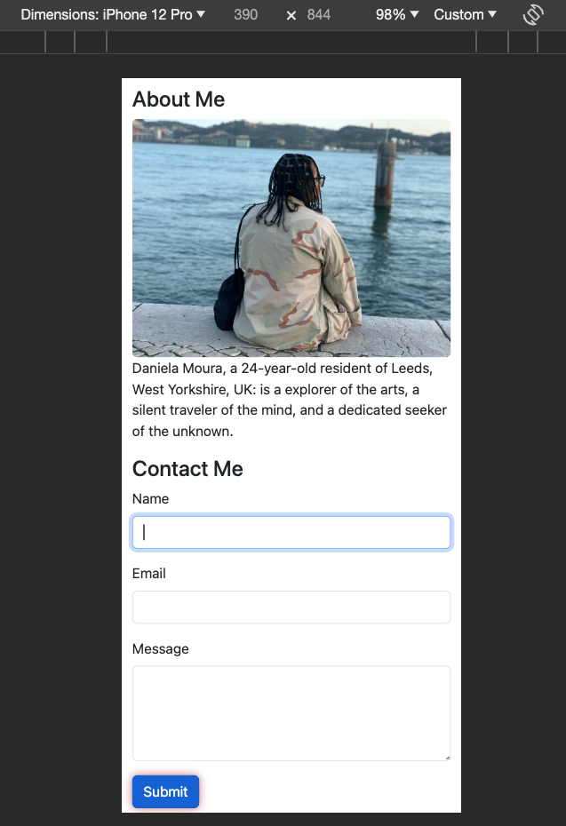
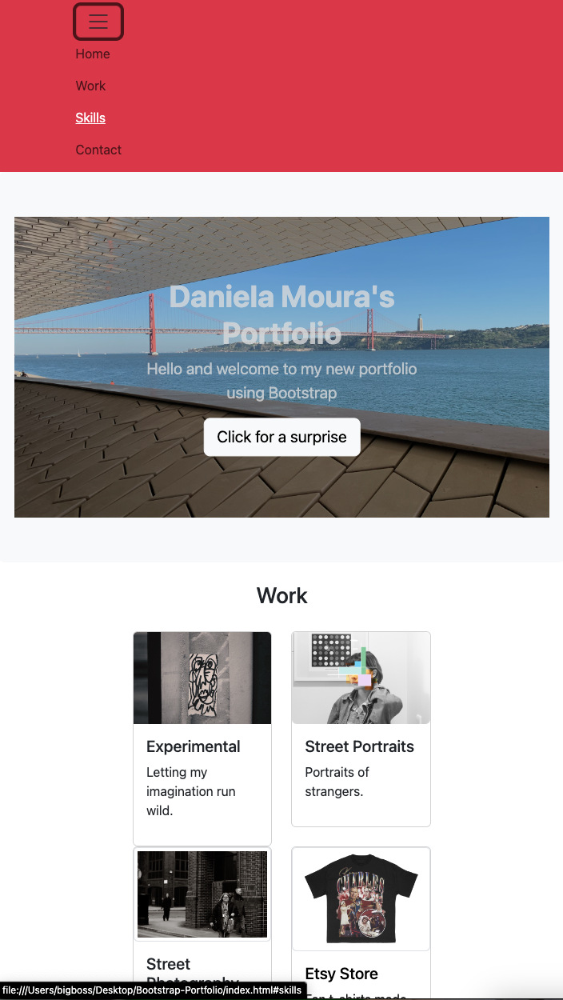
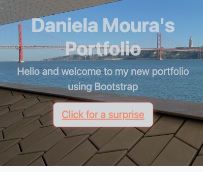
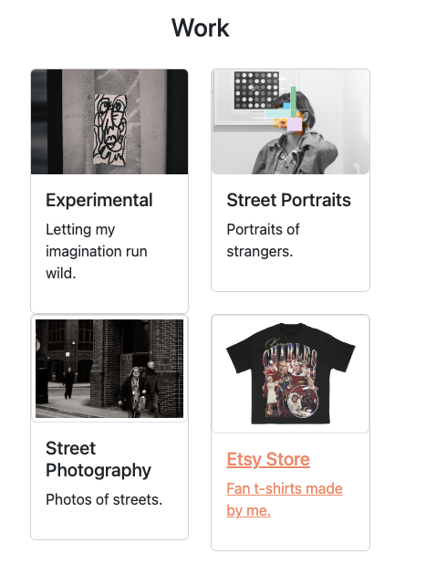
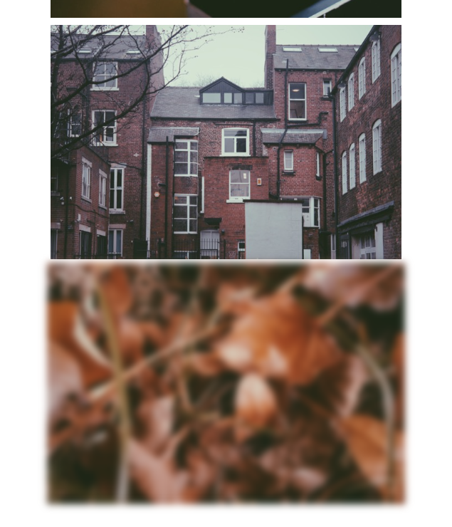

# Daniela Moura's Bootstrap Portfolio Website User Guide

Welcome to Daniela Moura's Portfolio Website, this version uses Bootstrap, CSS and HTML. Please follow this user guide to navigate through the website correctly.

## Table of Contents
1. [Website Overview](#website-overview)
2. [Copyright Notice](#copyright-notice)
3. [Navigation](#navigation)
4. [Sections and Links](#sections-and-links)
5. [Screenshots](#screenshots-of-project)

## Website Overview
Daniela Moura's Portfolio Website is a visually appealing platform that presents a collection of creative works and projects. Please respect the copyright laws and usage restrictions mentioned in the [Copyright Notice](#copyright-notice) section.

## Copyright Notice
All content on this website is protected by the Copyright, Designs and Patents Act 1988. It's essential to understand the following:

### Copyright Ownership
The content on this website is owned by Daniela Mendes Penelas De Moura, the creator and owner of this website.

### Usage Restrictions
You are not permitted to use, reproduce, distribute, or modify any content found on this website without explicit permission from Daniela M.P. De Moura. This includes text, images, graphics, and any other creative works.

For any inquiries regarding content usage, permissions, or other questions, please contact me using the provided email address in the [Contact Information](#contact-information) section.

## Navigation
The website is designed for easy navigation. You can use the top navigation bar to access different sections. Here's what each section contains:

## Sections and Links
1. **Home**: The landing page with a brief introduction.
2. **Work**: Explore my creative projects, including artwork and photography.
3. **Skills**: Find out about the skills I will learn in the bootcamp.
4. **Contact**: Learn more about about me in the "About Me" section, and use the provided contact form to get in touch.

Please note that the CSS is stored in the "CSS" folder, and the images are stored in the "Images" folder, and the ReadME images are stored on the "readme_img" folder.

## Contact Information
- **Email**: [Click here to view email address](mailto:themoney@duck.com)

## Screenshots of project:

Thank you for visiting my portfolio website.